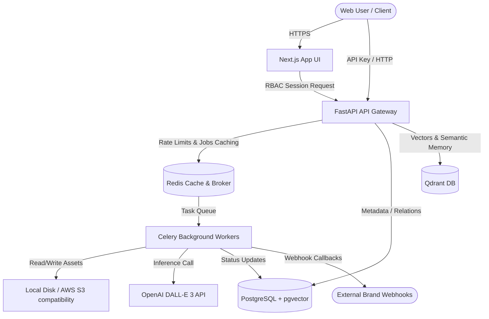

# ModelLens

[]()
[]()
[]()
[]()
[]()

ModelLens is an enterprise-grade, AI-powered visual catalog and model generation platform built for brands. The platform enables brands to manage high-resolution creative assets, construct marketing campaigns, define dynamic workflows, generate synthetic character models, and execute high-speed hybrid (FTS + vector) searches across their media libraries.

---

## 📖 Table of Contents

* [1. Architectural Overview](#1-architectural-overview)
* [2. Tech Stack](#2-tech-stack)
* [3. Core Features](#3-core-features)
  * [Multi-Tenant Brand RBAC](#multi-tenant-brand-rbac)
  * [Automated Asset Processing Pipeline](#automated-asset-processing-pipeline)
  * [AI Generation & Worker Resilience](#ai-generation--worker-resilience)
  * [Unified Hybrid Search Router](#unified-hybrid-search-router)
  * [API Keys Management](#api-keys-management)
* [4. Database Schema & Indexing](#4-database-schema--indexing)
* [5. API Endpoint Reference](#5-api-endpoint-reference)
* [6. Local Development Setup](#6-local-development-setup)
* [7. Production VM Deployment](#7-production-vm-deployment)
* [8. Testing Suite](#8-testing-suite)
* [9. Monitoring & Observability](#9-monitoring--observability)

---

## 1. Architectural Overview

ModelLens uses a decoupled microservices architecture designed to support high-throughput asset ingestion and heavy AI inference jobs.



---

## 2. Tech Stack

### Frontend & Gateway Layer
* **Framework**: Next.js 14 (App Router) & React
* **Styling**: Tailwind CSS & Framer Motion (for responsive, premium animations)
* **Auth**: NextAuth.js (Session-based Role-Based Access Control)
* **Client SDKs**: OpenAI Node SDK, Qdrant JS, Supabase Client

### Backend API Services
* **Framework**: FastAPI (Python 3.12+)
* **ORM & Driver**: SQLAlchemy & `asyncpg` (Fully asynchronous DB operations)
* **DB Migration**: Alembic

### Storage & Search Databases
* **Relational Database**: PostgreSQL 16 with `pgvector`
* **Vector Store**: Qdrant (Semantic tags & brand memory matching)
* **Storage**: Local filesystem storage with built-in S3-compatible service layers

---

## 3. Core Features

### Multi-Tenant Brand RBAC
The workspace enforces strict multi-tenancy. Users belong to Brands with granular roles (`Owner`, `Admin`, `Editor`, `Viewer`).
* **Owner/Admin**: Full permissions (delete assets, edit campaigns, manage API keys).
* **Editor**: Can upload assets, link workflows, and trigger generation jobs.
* **Viewer**: Read-only access to search and asset catalogs.

### Automated Asset Processing Pipeline
When an asset is uploaded, it automatically undergoes background processing via Celery:
1. **Validation**: Check file integrity and MIME type using Pillow.
2. **Deduplication**: Generate a SHA-256 hash of file contents; duplicates link back to the existing file.
3. **EXIF Parsing**: Extract camera make, model, standard resolution, and lens.
4. **Thumbnailing**: Generate `256px` and `512px` web-optimized representations.
5. **DB Update**: Save asset properties to PostgreSQL and cache details in Redis.

### AI Generation & Worker Resilience
ModelLens runs image/video workflows (such as Flat-Lay to Model, Mannequin to Model, background swapping) using OpenAI DALL-E 3 with a custom fallback option.
* **Credit Billing Security**: Deducts 1 credit (or 10 credits for model training) from user account.
* **Task Resilience**: Configured auto-retries with exponential backoff on Celery workers:
  * `autoretry_for=(httpx.HTTPError, RuntimeError)`
  * `max_retries=3`, `retry_backoff=True` with jitter.
* **Credit Refunds**: Credits are only refunded and the job marked `failed` once *all* 3 retries are exhausted. If a transient error passes on a retry, the job completes successfully and credits are kept.

### Unified Hybrid Search Router
Execute hybrid search across assets and catalogs:
* **FTS (Full-Text Search)**: Leverages PostgreSQL text search vector indices on file names, titles, and tags.
* **Vector Search**: Searches pgvector embeddings on tags for high-speed local matches.
* **Semantic Search**: Submits queries through `text-embedding-3-large` to match conceptual similarity against Qdrant collections.

### API Keys Management
Users can create, list, and revoke API keys from their Settings page. These keys authorize automated workflows through the backend API gateway using the `X-API-Key` header.

---

## 4. Database Schema & Indexing

To ensure maximum search performance at scale, the PostgreSQL database contains the following optimized indices:
* **GIN Index on Metadata JSONB**: `idx_assets_metadata_gin` on `assets(metadata jsonb_path_ops)` for instant property queries.
* **GIN Index on FTS Vector**: `idx_assets_name_metadata_fts` on assets combining asset name and metadata fields.
* **IVFFlat Cosine Index**: `idx_asset_tags_embedding_ivfflat` on `asset_tags(embedding vector_cosine_ops)` to speed up similarity lookups.

---

## 5. API Endpoint Reference

All endpoints (except Authentication) require a valid NextAuth session cookie or an `X-API-Key` header.

| Method | Endpoint | Description | Required Role |
| :--- | :--- | :--- | :--- |
| **GET** | `/api/v1/brands` | List authorized brands | Viewer |
| **POST** | `/api/v1/assets/upload` | Ingest assets & trigger processing | Editor |
| **DELETE** | `/api/v1/assets/{id}` | Delete asset and clean up disk/S3 storage | Owner / Admin |
| **POST** | `/api/v1/jobs/generate` | Trigger simple AI generation (1 credit) | Editor |
| **POST** | `/api/v1/jobs/workflow` | Trigger advanced workflow (e.g. flat-lay to model) | Editor |
| **GET** | `/api/v1/jobs/{id}/status` | Poll or fetch active job state | Viewer |
| **POST** | `/api/v1/search/hybrid` | Run hybrid (FTS + vector) search queries | Viewer |
| **POST** | `/api/v1/apikeys` | Create a new API key for the current user | Admin / Owner |

---

## 6. Local Development Setup

### Prerequisites
* [Docker Desktop](https://www.docker.com/products/docker-desktop/)
* Python 3.12+ (if running tests or services locally)

### 1. Configure Environment Variables
Copy `.env.example` in the backend folder to `.env` and fill in API keys:
```bash
cp backend/app/.env.example backend/app/.env
```

### 2. Boot Service Network
Boot database, cache, workers, and frontend via Docker Compose:
```bash
docker compose up --build -d
```
This starts:
* PostgreSQL on port `5432`
* Redis on port `6379`
* FastAPI Backend API on `http://localhost:8000`
* Next.js Frontend on `http://localhost:3000`
* Celery Worker
* Flower Task Monitor on `http://localhost:5555`

### 3. Seed Database
Initialize base templates and seed default workflows:
```bash
docker compose exec api python seed_workflow_templates.py
```

---

## 7. Production VM Deployment

Follow this runbook to update and rebuild services deployed on the Azure VM:

1. **SSH into the VM**:
   ```bash
   ssh azureuser@20.197.8.77
   ```
2. **Fetch Latest Main**:
   ```bash
   cd ~/modelens
   git pull myrepo main
   ```
3. **Rebuild Containers**:
   ```bash
   sudo docker compose build api worker
   ```
4. **Restart Stack**:
   ```bash
   sudo docker compose down
   sudo docker compose up -d
   ```
5. **Verify Migrations & Seed Templates**:
   ```bash
   sudo docker compose exec api alembic upgrade head
   sudo docker compose exec api python seed_workflow_templates.py
   ```

---

## 8. Testing Suite

ModelLens maintains a 100% passing testing suite leveraging in-memory isolated SQLite environments.

To execute tests:
1. Navigate to the backend folder and activate virtualenv:
   ```bash
   cd backend
   .venv/Scripts/activate
   ```
2. Run pytest:
   ```bash
   $env:PYTHONPATH="backend"
   python -m pytest tests/ -v
   ```

---

## 9. Monitoring & Observability

* **Celery Flower**: Access task completion status, latency, and retries dashboard at `http://localhost:5555`.
* **MLflow Tracking**: Monitor hyperparameters and training performance of synthetic model runs at `http://localhost:5000`.
* **FastAPI Logs**: View streaming JSON logs from Docker:
  ```bash
  docker compose logs -f api
  ```
