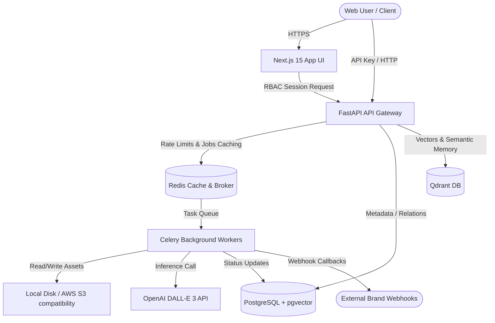

# ModelLens

[]()
[]()
[]()
[]()
[]()

ModelLens is an enterprise-grade, AI-powered visual catalog and model generation platform built for brands. The platform enables brands to manage high-resolution creative assets, construct marketing campaigns, define dynamic workflows, generate synthetic character models, and execute high-speed hybrid (FTS + vector) searches across their media libraries.

---

## 📖 Table of Contents

* [1. Architectural Overview](#1-architectural-overview)
* [2. Tech Stack](#2-tech-stack)
* [3. Core Features](#3-core-features)
  * [Multi-Tenant Brand RBAC](#multi-tenant-brand-rbac)
  * [Character Version Registry & Capability Packs](#character-version-registry--capability-packs)
  * [Presets Registry & Production Dispatch](#presets-registry--production-dispatch)
  * [Automated Asset Processing Pipeline](#automated-asset-processing-pipeline)
  * [AI Generation & Worker Resilience](#ai-generation--worker-resilience)
  * [Unified Hybrid Search Router](#unified-hybrid-search-router)
  * [API Keys Management](#api-keys-management)
* [4. Database Schema & Indexing](#4-database-schema--indexing)
* [5. API Endpoint Reference](#5-api-endpoint-reference)
* [6. Local Development Setup](#6-local-development-setup)
* [7. Production VM Deployment](#7-production-vm-deployment)
* [8. Testing Suite & CI/CD Pipelines](#8-testing-suite--cicd-pipelines)
* [9. Monitoring & Observability](#9-monitoring--observability)
* [10. Email Provider Setup](#10-email-provider-setup)
* [11. SSO Login Rate Limiting](#11-sso-login-rate-limiting)
* [12. Production Dispatch Rate Limiting](#12-production-dispatch-rate-limiting)

---

## 1. Architectural Overview

ModelLens uses a decoupled microservices architecture designed to support high-throughput asset ingestion and heavy AI inference jobs.


```mermaid
graph TD
    User([Web User / Client]) -->|HTTPS| Frontend[Next.js 15 App UI]
    User -->|API Key / HTTP| Backend[FastAPI API Gateway]
    
    Frontend -->|RBAC Session Request| Backend
    Backend -->|Rate Limits & Jobs Caching| Redis[(Redis Cache & Broker)]
    Backend -->|Metadata / Relations| DB[(PostgreSQL + pgvector)]
    Backend -->|Vectors & Semantic Memory| Qdrant[(Qdrant DB)]
    
    Redis -->|Task Queue| Worker[Celery Background Workers]
    Worker -->|Read/Write Assets| Storage[Local Disk / AWS S3 compatibility]
    Worker -->|Inference Call| OpenAI[OpenAI DALL-E 3 API]
    Worker -->|Status Updates| DB
    Worker -->|Webhook Callbacks| Webhook([External Brand Webhooks])
```

---

## 2. Tech Stack

### Frontend & Gateway Layer
* **Framework**: Next.js 15 (App Router & Pages) & React 19 (Node 20+)
* **Styling**: Tailwind CSS & Framer Motion (for responsive, premium animations)
* **Auth**: NextAuth.js (Session-based Role-Based Access Control)
* **Client SDKs**: OpenAI Node SDK, Qdrant JS, Supabase Client

### Backend API Services
* **Framework**: FastAPI (Python 3.12+)
* **ORM & Driver**: SQLAlchemy & `asyncpg` (Fully asynchronous DB operations)
* **DB Migration**: Alembic with idempotent `migration_guard`

### Storage & Search Databases
* **Relational Database**: PostgreSQL 16 with `pgvector`
* **Vector Store**: Qdrant (Semantic tags & brand memory matching)
* **Storage**: Local filesystem storage with built-in S3-compatible service layers

---

## 3. Core Features

### Multi-Tenant Brand RBAC
The workspace enforces strict multi-tenancy. Users belong to Brands with granular roles (`Owner`, `Admin`, `Editor`, `Viewer`).
* **Owner/Admin**: Full permissions (delete assets, edit campaigns, manage API keys, promote models).
* **Editor**: Can upload assets, link workflows, and trigger generation jobs.
* **Viewer**: Read-only access to search and asset catalogs.

### Character Version Registry & Capability Packs
ModelLens enforces immutable character identity DNA alongside versioned capability packs:
* **Canonical Identity Lock**: Locked character definitions (such as `EE-F-002` V1.0) maintain fixed visual attributes, face vectors, and baseline proportions.
* **Capability Packs**: Modular packs defining allowed pose ranges, lighting rigs, styling options, and camera perspectives.
* **Model Promotion Guards**: `PATCH /api/v1/models/{model_id}/promote` is restricted to platform administrators.

### Presets Registry & Production Dispatch
* **Presets Registry**: Database-backed endpoints for Location, Lighting, and Campaign presets (`/api/v1/presets/*`).
* **Unified Production Dispatch**: `POST /api/v1/production/dispatch` validates character capability packs, applies pose and lighting resolvers, and coordinates generation workflows.

### Automated Asset Processing Pipeline
When an asset is uploaded, it automatically undergoes background processing via Celery:
1. **Validation**: Check file integrity and MIME type using Pillow.
2. **Deduplication**: Generate a SHA-256 hash of file contents; duplicates link back to the existing file.
3. **EXIF Parsing**: Extract camera make, model, standard resolution, and lens.
4. **Thumbnailing**: Generate `256px` and `512px` web-optimized representations.
5. **DB Update**: Save asset properties to PostgreSQL and cache details in Redis.

### AI Generation & Worker Resilience
ModelLens runs image/video workflows (such as Flat-Lay to Model, Mannequin to Model, Move Studio, background swapping) using OpenAI DALL-E 3 with a custom fallback option.
* **Credit Billing Security**: Deducts 1 credit (or 10 credits for model training) from user account.
* **Task Resilience**: Configured auto-retries with exponential backoff on Celery workers:
  * `autoretry_for=(httpx.HTTPError, RuntimeError)`
  * `max_retries=3`, `retry_backoff=True` with jitter.
* **Credit Refunds**: Credits are only refunded and the job marked `failed` once *all* 3 retries are exhausted. If a transient error passes on a retry, the job completes successfully and credits are kept.

### Unified Hybrid Search Router
Execute hybrid search across assets and catalogs:
* **FTS (Full-Text Search)**: Leverages PostgreSQL text search vector indices on file names, titles, and tags.
* **Vector Search**: Searches pgvector embeddings on tags for high-speed local matches.
* **Semantic Search**: Submits queries through `text-embedding-3-large` to match conceptual similarity against Qdrant collections.

### API Keys Management
Users can create, list, and revoke API keys from their Settings page. These keys authorize automated workflows through the backend API gateway using the `X-API-Key` header.

---

## 4. Database Schema & Indexing

To ensure maximum search performance at scale, the PostgreSQL database contains the following optimized indices:
* **GIN Index on Metadata JSONB**: `idx_assets_metadata_gin` on `assets(metadata jsonb_path_ops)` for instant property queries.
* **GIN Index on FTS Vector**: `idx_assets_name_metadata_fts` on assets combining asset name and metadata fields.
* **IVFFlat Cosine Index**: `idx_asset_tags_embedding_ivfflat` on `asset_tags(embedding vector_cosine_ops)` to speed up similarity lookups.

---

## 5. API Endpoint Reference

All endpoints (except Authentication and Health) require a valid NextAuth session cookie or an `X-API-Key` header.

| Method | Endpoint | Description | Required Role |
| :--- | :--- | :--- | :--- |
| **GET** | `/api/v1/health/live` | Process liveness probe | Public |
| **GET** | `/api/v1/health` | Dependency readiness probe (DB & Redis) | Public |
| **GET** | `/api/v1/brands` | List authorized brands | Viewer |
| **POST** | `/api/v1/assets/upload` | Ingest assets & trigger processing | Editor |
| **DELETE** | `/api/v1/assets/{id}` | Delete asset and clean up disk/S3 storage | Owner / Admin |
| **POST** | `/api/v1/jobs/generate` | Trigger simple AI generation (1 credit) | Editor |
| **POST** | `/api/v1/jobs/workflow` | Trigger advanced workflow (e.g. flat-lay to model) | Editor |
| **POST** | `/api/v1/production/dispatch` | Dispatch production photoshoot run | Editor |
| **GET** | `/api/v1/presets/locations` | Fetch location presets registry | Viewer |
| **GET** | `/api/v1/presets/lighting` | Fetch lighting presets registry | Viewer |
| **GET** | `/api/v1/presets/campaigns` | Fetch campaign presets registry | Viewer |
| **GET** | `/api/v1/characters` | Fetch registered character models & capability packs | Viewer |
| **PATCH** | `/api/v1/models/{id}/promote` | Promote custom trained model | Admin / Owner |
| **GET** | `/api/v1/jobs/{id}/status` | Poll or fetch active job state | Viewer |
| **POST** | `/api/v1/search/hybrid` | Run hybrid (FTS + vector) search queries | Viewer |
| **POST** | `/api/v1/apikeys` | Create a new API key for the current user | Admin / Owner |

---

## 6. Local Development Setup

### Prerequisites
* [Docker Desktop](https://www.docker.com/products/docker-desktop/)
* Python 3.12+ (if running tests or services locally)

### 1. Configure Environment Variables
Copy `.env.example` in the backend folder to `.env` and fill in API keys:
```bash
cp backend/app/.env.example backend/app/.env
```

### 2. Boot Service Network
Boot database, cache, workers, and frontend via Docker Compose:
```bash
docker compose up --build -d
```
This starts:
* PostgreSQL on port `5432`
* Redis on port `6379`
* FastAPI Backend API on `http://localhost:8000`
* Next.js Frontend on `http://localhost:3000`
* Celery Worker
* Flower Task Monitor on `http://localhost:5555`

### 3. Seed Database
Initialize base templates and seed default workflows:
```bash
docker compose exec api python seed_workflow_templates.py
```

### 4. If local migrations fail
The API container runs `backend/scripts/start-api.sh`, which runs `alembic upgrade head` before starting the API. If the upgrade fails, the API is not started. The script prints the revision your database has recorded and the repository head, then exits.

1. **Rebuild the image first.** The API image contains a copy of the code; it does not mount it. A stale image still has old migrations:
   ```bash
   docker compose build api
   docker compose up -d api
   docker compose logs -f api
   ```
2. **Compare the record with the repository** (both are read-only):
   ```bash
   docker compose run --rm api alembic current   # revision stored in alembic_version
   docker compose run --rm api alembic heads     # must print exactly one head
   docker compose exec postgres psql -U postgres -d modelens -c '\dt'
   ```
   More than one head means two branches added migrations in parallel. Add a merge migration (`alembic merge -m "merge heads" <head1> <head2>`) in a PR. `tests/test_alembic_migrations.py` fails in that case.
3. **`DuplicateTableError` / "relation ... already exists"** means your schema is ahead of `alembic_version`: tables exist from migrations that were never recorded. The migrations from `architecture_v1_001` to `fluid_studio_001` use `create_table_if_absent` (`backend/app/migration_guard.py`). A table that already exists with exactly the expected columns is skipped, and the revision is recorded as usual. After pulling this fix, rebuild (step 1) and the upgrade continues on its own. Use `create_table_if_absent` in new migrations too.
4. **`SchemaMismatch: Table '...' already exists but does not match this migration`** means a table exists but has different columns, for example from a half-applied migration or a manual change. The message lists every difference. Nothing is skipped and nothing is changed; the whole upgrade is rolled back. Fix that table to match the migration, or ask in the team channel. Do not delete data to get past it.
5. **Last resort, and only after agreeing with the team:** if you have confirmed that the schema matches a later revision exactly, `alembic stamp <revision>` records that revision without running anything. Never stamp a revision whose tables or columns are actually missing.

Do not run `docker compose down -v`, `docker volume rm` or `docker system prune` to "fix" migrations. They delete your local database.

---

## 7. Production VM Deployment

Follow this runbook to update and rebuild services deployed on the Azure VM:

1. **SSH into the VM**:
   ```bash
   ssh azureuser@20.197.8.77
   ```
2. **Fetch Latest Main**:
   ```bash
   cd ~/modelens
   git pull myrepo main
   ```
3. **Rebuild Containers**:
   ```bash
   sudo docker compose build api worker
   ```
4. **Restart Stack**:
   ```bash
   sudo docker compose down
   sudo docker compose up -d
   ```
5. **Verify Migrations & Seed Templates**:
   ```bash
   sudo docker compose exec api alembic upgrade head
   sudo docker compose exec api python seed_workflow_templates.py
   ```

---

## 8. Testing Suite & CI/CD Pipelines

The backend suite (about 1,100 tests in `backend/tests/`) runs on SQLite with Redis, Celery and MLflow mocked in `tests/conftest.py`. No running services or real keys are needed.

**What keeps it fast**
- The schema is built once per session into a template SQLite file; every test gets its own fresh copy of it, so tests stay fully isolated.
- With `TESTING=true`, bcrypt uses cost 4 instead of 12. Production hashing stays at cost 12 (`tests/test_password_hashing.py` checks this).
- Retry backoffs and the Celery worker ping are mocked instead of really waited on.

**Markers** (`backend/pytest.ini`)
- `integration`: runs Celery worker task bodies, websockets or migrations.
- `slow`: still takes over ~1s.

**Running tests** (from `backend/`, with `TESTING=true` set)
```bash
pip install -r app/requirements.txt -r tests/requirements-test.txt
export TESTING=true

python -m pytest -m "not slow and not integration"   # fast tests (what PRs gate on)
python -m pytest -m "slow or integration"            # slow + integration tests
python -m pytest                                     # everything
python -m pytest -n auto                             # everything, in parallel (pytest-xdist)
```

Or in a throwaway container from the API image (nothing is written to the repo):
```bash
cd backend
docker run --rm -v "$PWD":/src:ro -e TESTING=true --entrypoint sh indra-modelens-api:latest -c \
  "cp -r /src /tmp/work && cd /tmp/work && pip install -q -r tests/requirements-test.txt && python -m pytest -m 'not slow and not integration'"
```

### GitHub Actions Workflows

1. **`backend-tests.yml` (Primary PR Gate)**:
   - **Fast tests (unit + API)**: Checks that every collected test is in exactly one of the two jobs, then runs `-m "not slow and not integration"` (~1 min). Required PR status check.
   - **Slow + integration tests**: Runs `-m "slow or integration"` in parallel.
2. **`backend.yaml` (Backend CI & Docker)**:
   - Runs flake8 linting, Trivy vulnerability scans, SonarQube, and Docker build.
   - SSH deploy step is guarded by secret checks (`DEPLOY_HOST`, `DEPLOY_USER`, `DEPLOY_SSH_KEY`) and supports manual trigger via `workflow_dispatch`.
3. **`ci-cd.yml` (ModeLens CI/CD Pipeline)**:
   - Backend syntax check (`compileall`), Frontend Next.js build on Node 20.
   - Vercel and Railway deployments are cleanly skipped when respective secrets are absent and support manual triggering from `main`.

---

## 9. Monitoring & Observability

* **Celery Flower**: Access task completion status, latency, and retries dashboard at `http://localhost:5555`.
* **MLflow Tracking**: Monitor hyperparameters and training performance of synthetic model runs at `http://localhost:5000`.
* **FastAPI Logs**: View streaming JSON logs from Docker:
  ```bash
  docker compose logs -f api
  ```

### Health checks

Both endpoints are public (no auth) and not rate limited.

| Endpoint | Use for | Checks | Responses |
| :--- | :--- | :--- | :--- |
| `GET /api/v1/health/live` | **Liveness**: container healthchecks, Kubernetes `livenessProbe` | Nothing; the API process answered | `200 {"status": "alive"}` |
| `GET /api/v1/health` | **Readiness**: Kubernetes `readinessProbe`, load-balancer target health | Database (`SELECT 1`) and Redis (`PING`), 2s each | `200` when both are up; `503` with `failing: ["database" \| "redis"]` when either is down |

Point restart-triggering probes at `/live` only. If liveness used `/api/v1/health`, a short DB or Redis outage would restart every API container at once. Readiness takes the instance out of rotation until its dependencies are back. Celery workers are not part of either check; worker pods use their own `celery inspect ping` probe. `GET /health` is an older liveness alias.

---

## 10. Email Provider Setup

ModeLens supports transactional email delivery for low-credit alerts via **SendGrid** or **AWS SES**.

### Environment Variables

| Variable | Description | Default |
| :--- | :--- | :--- |
| `EMAIL_PROVIDER` | Email provider to use (`sendgrid` or `ses`) | `sendgrid` |
| `SENDGRID_API_KEY` | SendGrid API key (required if using SendGrid) | — |
| `SES_REGION` | AWS SES region (required if using SES) | `us-east-1` |
| `FROM_EMAIL` | Sender email address | `no-reply@modelens.com` |

### SendGrid Setup
1. Create a free account at [sendgrid.com](https://sendgrid.com/).
2. Navigate to **Settings → API Keys** and create a key with "Mail Send" permissions.
3. Add the key to your `.env`:
   ```bash
   EMAIL_PROVIDER=sendgrid
   SENDGRID_API_KEY=SG.your_api_key_here
   FROM_EMAIL=no-reply@modelens.com
   ```

### AWS SES Setup
1. Ensure your AWS credentials (`AWS_ACCESS_KEY_ID`, `AWS_SECRET_ACCESS_KEY`) are configured.
2. Verify your sender email in the SES console.
3. Add the settings to your `.env`:
   ```bash
   EMAIL_PROVIDER=ses
   SES_REGION=us-east-1
   FROM_EMAIL=no-reply@modelens.com
   ```

### Testing Email Locally
Run the email integration tests to verify your setup (no real emails are sent during testing):
```bash
python -m pytest tests/test_low_credit_email.py -v
```

---

## 11. SSO Login Rate Limiting

`POST /api/v1/auth/sso-login` is limited **per client IP** (checked before the Google/GitHub credential is verified) and **per account** (the provider-verified email, checked before the user is looked up or a session is issued). Either limit answers `429` with a `Retry-After` header and the same body, `{"detail": "Too many sign-in attempts. Please wait and try again."}`, so the response never reveals whether an account exists.

Counters are kept in Redis (`REDIS_URL`) so the limits hold across API workers. If Redis is unreachable, each process falls back to an in-memory window; local runs and tests need no setup.

### Environment Variables

| Variable | Description | Default |
| :--- | :--- | :--- |
| `SSO_RATE_LIMIT_REQUESTS` | SSO login requests allowed per client IP per window | `10` |
| `SSO_RATE_LIMIT_WINDOW_SECONDS` | Per-IP window, in seconds | `60` |
| `SSO_RATE_LIMIT_ACCOUNT_REQUESTS` | SSO login requests allowed per account per window | `5` |
| `SSO_RATE_LIMIT_ACCOUNT_WINDOW_SECONDS` | Per-account window, in seconds | `300` |
| `SSO_RATE_LIMIT_TRUSTED_PROXIES` | Comma-separated IPs/CIDRs of reverse proxies allowed to set `X-Forwarded-For` | empty |

### Behind a proxy

With `SSO_RATE_LIMIT_TRUSTED_PROXIES` empty, `X-Forwarded-For` is ignored and the client IP is the TCP peer, so clients cannot spoof their IP. When the API sits behind a proxy (the Next.js `/api/v1` rewrite, a load balancer or ingress), list that proxy's address(es) here, otherwise every user shares the proxy's IP and its per-IP limit:

```bash
SSO_RATE_LIMIT_TRUSTED_PROXIES=10.0.0.0/8,172.16.0.0/12
```

`X-Forwarded-For` is then read right to left, skipping trusted proxies; the first untrusted address is the client.

---

## 12. Production Dispatch Rate Limiting

`POST /api/v1/productions/dispatch` is limited **per brand** (the brand whose credits are charged) and **per user** (across all of their brands). Over either limit the API answers `429` with a `Retry-After` header and a JSON body (`detail.error` is `rate_limited`, `detail.scope` is `brand` or `user`). Nothing is queued or charged. Replaying an `Idempotency-Key` returns the original production and does not count against either limit.

The per-brand limit is the **Orchestrator Limit** admin setting (`orchestrator_rate_limit`, dispatches per minute), edited in the admin dashboard or with `POST /api/v1/admin/settings`. It is stored in Redis and applies immediately. Until it is set, `ORCHESTRATOR_RATE_LIMIT` is used.

Counters are kept in Redis (`REDIS_URL`), with an in-memory fallback per process when Redis is unreachable, as for SSO login.

| Variable | Description | Default |
| :--- | :--- | :--- |
| `ORCHESTRATOR_RATE_LIMIT` | Dispatches allowed per brand per minute, until the admin setting is saved | `10` |
| `DISPATCH_RATE_LIMIT_USER_REQUESTS` | Dispatches allowed per user per window | `5` |
| `DISPATCH_RATE_LIMIT_USER_WINDOW_SECONDS` | Per-user window, in seconds | `60` |

### Production metrics

`GET /api/v1/admin/settings` returns `metrics.productions_*`, counted from the database by each production's job status: `productions_success` (completed), `productions_failed` (failed or timed out), `productions_total` (success + failed, so success / total is the success rate), `productions_in_progress` (queued or running), and `productions_cancelled` (not counted in total). `productions_retries` is always `0` because productions are never retried. Platform admins see every brand; brand admins and owners see only their own brands.
